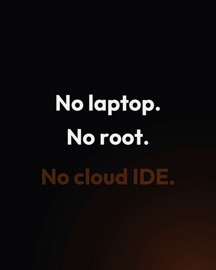

<p align="center">
  
</p>

<h1 align="center">TermFold</h1>

<p align="center">
  <b>A real Ubuntu terminal and AI coding agents on your Android tablet or phone.</b><br>
  Claude Code, Codex, Gemini CLI, OpenCode, Cursor, Pi and more, in real Linux projects.<br>
  No root. No laptop. No cloud IDE.
</p>

<p align="center">
  <a href="https://github.com/Bibarud/TermFold/releases/latest"></a>
  
  
  <a href="LICENSE"></a>
</p>

<p align="center">
  <a href="https://github.com/Bibarud/TermFold/releases/latest"></a>
  <a href="https://apps.obtainium.imranr.dev/redirect?r=obtainium://add/https://github.com/Bibarud/TermFold"></a>
</p>

<p align="center">
  <a href="docs/media/termfold-promo.mp4"></a><br>
  <sub><a href="docs/media/termfold-promo.mp4">▶ Watch the 50-second film (with sound)</a></sub>
</p>


| Native chat with any ACP agent | Model, reasoning and mode in one tap |
| --- | --- |
|  |  |

## Why TermFold

You have a tablet with a keyboard, and you want to code on it: run `git`, `python`, `node`, and
the AI coding agents everyone uses on a laptop. On Android that usually means juggling a terminal
app, proot scripts and broken package installs. TermFold is one app that does it all:

- **A full Ubuntu 24.04 environment inside the app.** `apt install` anything. Python, Node 22,
  git, build tools, SSH and SCP work out of the box after a one-time setup.
- **Real Linux projects.** Projects live in Ubuntu's own storage (`~/projects`), so symlinks,
  permissions, executables, git, npm and virtualenvs behave exactly as on a PC. Start one empty,
  clone it from Git, or import a folder from the device.
- **Every popular coding agent.** Run `claude`, `codex`, `gemini`, `opencode`, `pi` or `qwen`
  in the terminal; each installs itself the first time you type it.
- **Or talk to them natively.** Agents that speak the [Agent Client Protocol](https://agentclientprotocol.com)
  get a real chat UI: Markdown with code blocks and tables, a live thinking ticker, tool calls with file
  names, plans, permission prompts, slash commands, and a model / reasoning / mode picker.
  Supported out of the box: Claude, Codex, OpenCode, Cursor, Devin, Pi, omp and Google Antigravity.
- **A file manager built in.** Browse your Linux home, your projects or the whole system;
  search, sort, list or grid; create, rename, copy, move and delete. Code opens in a real editor
  (CodeMirror: 40+ languages, search, undo, Ctrl+S) that reloads files an agent changes. Pictures
  open in a zoomable viewer that can copy them to the clipboard, ready to paste into an agent.
  On a tablet the places sit in a side pane; a Files button in every project, chat and shell
  shows the project tree.
- **Files in and out, any type.** Upload files or whole folders, or share to TermFold from any
  app (a PDF for an agent, a dataset, screenshots). Export to any folder on the device, share, or
  open with another app. TermFold also appears in Android's own file picker, so other apps can
  open your project files directly; hidden files such as agent sign-ins are never exposed.
- **A browser beside your work.** Preview dev servers (`localhost:5173`), the project's own
  pages (served like a real server, reloading as files change) or any site, next to the chat on
  a tablet. Phone and desktop widths, the page's console with a copy button, and screenshots to
  the clipboard or the project. Running dev servers show up by themselves. Minimize it to a
  small pill you can drag anywhere; the page keeps running, so an agent can keep using it.
- **Agents use the browser too.** Agents open pages, read them, click, type, fill forms, scroll,
  take screenshots and read the console, with real taps and keys, while you watch an orange
  frame and their pointer move. Chat agents get it as MCP tools automatically; in a shell it is
  the `termfold-browser` command, with a skill for Claude Code and notes for Codex, Gemini,
  OpenCode, pi and Qwen. Stop hands the browser back to you at any moment.
- **Pick up where you left off.** Chats reopen their last session, and `/resume` (or the history
  button) lists the agent's earlier sessions in that folder to continue any of them.
- **Keeps working while you're elsewhere.** Leave the app and TermFold floats as an Android
  bubble that opens right where you were. Agents keep running in the background, and you get a
  notification when one finishes, needs permission, or a long command in a shell ends.
- **Built for tablets.** Full-width Ctrl / Alt / Esc / Tab / arrow key rows with repeating
  arrows, physical-keyboard support (the on-screen keyboard steps aside while you type on a real
  one), JetBrains Mono, pinch to zoom.
- **Paste anything.** Paste images into the chat, or into the terminal where they arrive as a file
  path that Claude Code and Codex attach. Long pastes in the chat become `.txt` attachments.
- **No root, no Termux, no account.** Everything runs inside the app. Open source under Apache-2.0.

## Install

1. Download the `.apk` from the [latest release](https://github.com/Bibarud/TermFold/releases/latest)
   and install it (allow installs from your browser or file manager when asked).
2. Open TermFold and tap **+** to start a project: empty, cloned from Git, or imported from the
   device.
3. Open **Shell**. The first time, it sets up Ubuntu for coding (updates, build tools, git,
   Python, Node 22). This downloads a few hundred MB, once.
4. Type `claude`, `codex`, `gemini`, `opencode` or `pi`, or add an **ACP** session for the native
   chat. Sign in once in a Shell (for example `claude` or `codex login`), and the chat uses the
   same sign-in.

Requirements: Android 8.0+ on an arm64 (almost every phone and tablet) or x86_64 device, and a
few GB of free space for Ubuntu and the tools you install.

**Automatic updates:** add the repo to [Obtainium](https://github.com/ImranR98/Obtainium) (badge
above) and it installs each new release for you.

**Why not Google Play?** Play only accepts apps that target a recent Android version, and those
are not allowed to run programs they ship themselves, which is exactly what a Linux environment
does. TermFold targets an older version on purpose (Termux does the same), so it is distributed
here instead. Every release is built from this repository and signed with the same key, and each
one lists its SHA-256 checksum.

## How it works

```
TermFold (Kotlin, Jetpack Compose)
  ├── Terminal: Termux's terminal emulator + view, on a real PTY
  ├── ACP client: JSON-RPC over the agent's stdio, rendered as native UI
  └── PRoot (userspace chroot, from nativeLibraryDir)
        └── Ubuntu 24.04 base image, unpacked into app storage, persistent
              └── bash, apt, git, python, node, the agents…
```

Projects are ordinary directories in `~/projects`, and every shell or agent session starts in
its project. Nothing depends on Android's shared storage, which cannot hold symlinks, hard links,
permissions or executables. Android also forbids hard links in app storage, so a tiny library
preloaded into every guest program (`/etc/ld.so.preload`, as a distribution would) turns a refused
hard link into a real copy: dpkg, npm, git, pip and tar all work unchanged. Everything installed
with `apt` or `npm` persists across restarts and app updates.

Getting a full Linux userland to behave inside an Android app took working around a dozen
platform restrictions (W^X on app storage, a seccomp filter that blocks `fork` and `rename`,
forbidden hard links, no CA bundle, symlink-less shared storage, and more). Each one, with its
symptom and its fix, is written up in [docs/SHELL-NOTES.md](docs/SHELL-NOTES.md).

## Building

```bash
py -3 tools/fetch-shell-runtime.py    # PRoot and the Ubuntu images, into jniLibs/ and assets/
py -3 tools/fetch-ca-bundle.py        # the CA bundle, into assets/
./gradlew :app:assembleDebug
```

Release builds are signed when `termfold-release.jks` exists at the repo root and
`termfold.storePassword` is set in `local.properties` (or `TERMFOLD_STORE_PASSWORD` in the
environment). Without them the release APK is built unsigned.

Tests: `./gradlew :app:testDebugUnitTest`.

Other tools:
- `tools/make-icons.py` regenerates the launcher icon from `tools/brand/logo-source.png`
- `tools/build-compat-shim.py` rebuilds the compatibility library preloaded into the guest (needs `pip install ziglang`)
- `tools/editor/` is the code editor's source (`npm install && npm run build` writes `assets/editor/editor.js`)
- `tools/make-file-icons.py` bundles the file tree's icons from the `material-icon-theme` npm package
- `tools/promo-v2/` is the launch film (Remotion, real device footage) and `music.py`, its original soundtrack
- `tools/translations.py` writes the translated strings from one table
- `app/src/main/assets/termfold-browser.js` is the agent side of the browser (command and MCP server); `termfold-browser-skill.md` is the guide installed for agents

## Limits

- **Architecture:** the Ubuntu image must match the CPU (arm64 or x86_64); there is no emulation.
- **Not a VM.** It is the Android kernel with a translated filesystem: no `systemd`, kernel
  modules or raw sockets. `apt`, compilers, language runtimes and full-screen TUIs all work.
- **Uninstalling (or clearing the app's data) deletes the Ubuntu environment and your projects**,
  since they live in the app's storage. Push to git, or export projects to the device from Files,
  to keep a copy.

## Contributing

Issues and pull requests are welcome. If something does not work on your device, please include
the device model, Android version, and what the terminal or agent printed.

## License

TermFold is licensed under the [Apache License 2.0](LICENSE). The APK also contains third-party
components under their own licenses (PRoot, talloc, the Termux terminal libraries, the Ubuntu base
image, the Outfit and JetBrains Mono fonts); see [THIRD_PARTY_NOTICES.md](THIRD_PARTY_NOTICES.md).
