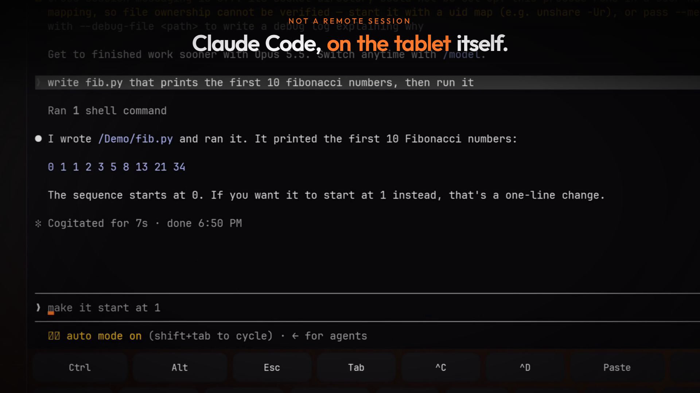
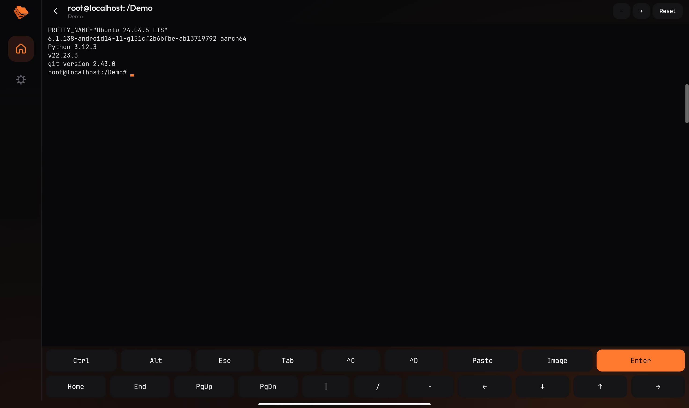
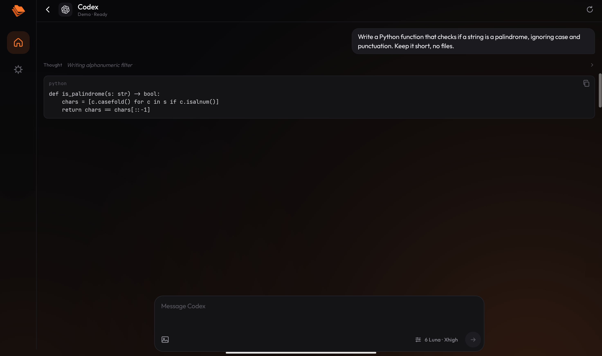
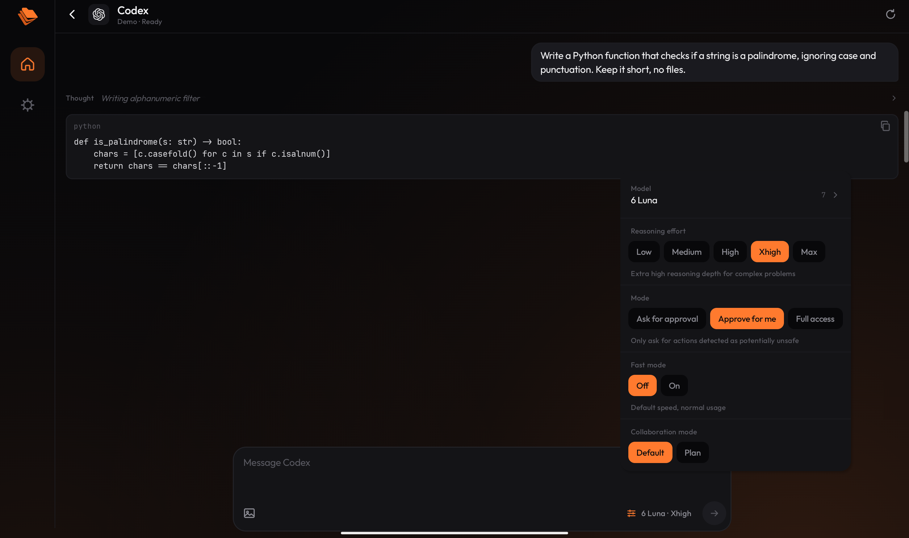

<p align="center">
  
</p>

<h1 align="center">TermFold</h1>

<p align="center">
  <b>A real Ubuntu terminal and AI coding agents on your Android tablet or phone.</b><br>
  Claude Code, Codex, Gemini CLI, OpenCode, Cursor, Pi and more, in the folder you are working in.<br>
  No root. No laptop. No cloud IDE.
</p>

<p align="center">
  <a href="https://github.com/Bibarud/TermFold/releases/latest"></a>
  
  
  <a href="LICENSE"></a>
</p>

<p align="center">
  <a href="docs/media/termfold-promo.mp4"></a><br>
  <sub><a href="docs/media/termfold-promo.mp4">▶ Watch the 30-second video</a></sub>
</p>



| Native chat with any ACP agent | Model, reasoning and mode in one tap |
| --- | --- |
|  |  |

## Why TermFold

You have a tablet with a keyboard, and you want to code on it: run `git`, `python`, `node`, and
the AI coding agents everyone uses on a laptop. On Android that usually means juggling a terminal
app, proot scripts and broken package installs. TermFold is one app that does it all:

- **A full Ubuntu 24.04 environment inside the app.** `apt install` anything. Python, Node 22,
  git, build tools, SSH and SCP work out of the box after a one-time setup.
- **Opens in your project folder.** Pick any folder on the device; every session starts there,
  and the files stay where your other apps can see them.
- **Every popular coding agent.** Run `claude`, `codex`, `gemini`, `opencode`, `pi` or `qwen`
  in the terminal; each installs itself the first time you type it.
- **Or talk to them natively.** Agents that speak the [Agent Client Protocol](https://agentclientprotocol.com)
  get a real chat UI: Markdown and code blocks, a live thinking ticker, tool calls with file
  names, plans, permission prompts, slash commands, and a model / reasoning / mode picker.
  Supported out of the box: Claude, Codex, OpenCode, Cursor, Devin, Pi, omp and Google Antigravity.
- **Your files, next to your work.** A Files button in every folder, chat and shell opens the
  project's file tree (with VS Code's file icons). Tap a file to open it in a code editor
  (CodeMirror: syntax highlighting for 40+ languages, search, undo, Ctrl+S). Files an agent
  changes reload on their own; long-press to delete.
- **Pick up where you left off.** Chats reopen their last session, and `/resume` (or the history
  button) lists the agent's earlier sessions in that folder to continue any of them.
- **Built for tablets.** Full-width Ctrl / Alt / Esc / Tab / arrow key rows with repeating
  arrows, physical-keyboard support (the on-screen keyboard steps aside while you type on a real
  one), JetBrains Mono, pinch to zoom.
- **Paste anything.** Paste images into the chat, or into the terminal where they arrive as a file
  path that Claude Code and Codex attach. Long pastes in the chat become `.txt` attachments.
- **No root, no Termux, no account.** Everything runs inside the app. Open source under Apache-2.0.

## Install

1. Download the `.apk` from the [latest release](https://github.com/Bibarud/TermFold/releases/latest)
   and install it (allow installs from your browser or file manager when asked).
2. Open TermFold, grant storage access, and tap **+** to pick a project folder.
3. Open **Shell**. The first time, it sets up Ubuntu for coding (updates, build tools, git,
   Python, Node 22). This downloads a few hundred MB, once.
4. Type `claude`, `codex`, `gemini`, `opencode` or `pi`, or add an **ACP** session for the native
   chat. Sign in once in a Shell (for example `claude` or `codex login`), and the chat uses the
   same sign-in.

Requirements: Android 8.0+ on an arm64 (almost every phone and tablet) or x86_64 device, and a
few GB of free space for Ubuntu and the tools you install.

## How it works

```
TermFold (Kotlin, Jetpack Compose)
  ├── Terminal: Termux's terminal emulator + view, on a real PTY
  ├── ACP client: JSON-RPC over the agent's stdio, rendered as native UI
  └── PRoot (userspace chroot, from nativeLibraryDir)
        └── Ubuntu 24.04 base image, unpacked into app storage, persistent
              └── bash, apt, git, python, node, the agents…
```

Your project folder is bind-mounted into Ubuntu under its own name (`/MyProject`), so a shell or
agent starts right where your files are. Everything installed with `apt` or `npm` persists across
restarts and app updates.

Getting a full Linux userland to behave inside an Android app took working around a dozen
platform restrictions (W^X on app storage, a seccomp filter that blocks `fork` and `rename`,
forbidden hard links, no CA bundle, symlink-less shared storage, and more). Each one, with its
symptom and its fix, is written up in [docs/SHELL-NOTES.md](docs/SHELL-NOTES.md).

## Building

```bash
py -3 tools/fetch-shell-runtime.py    # PRoot and the Ubuntu images, into jniLibs/ and assets/
py -3 tools/fetch-ca-bundle.py        # the CA bundle, into assets/
./gradlew :app:assembleDebug
```

Release builds are signed when `termfold-release.jks` exists at the repo root and
`termfold.storePassword` is set in `local.properties` (or `TERMFOLD_STORE_PASSWORD` in the
environment). Without them the release APK is built unsigned.

Tests: `./gradlew :app:testDebugUnitTest`.

Other tools:
- `tools/make-icons.py` regenerates the launcher icon from `tools/brand/logo-source.png`
- `tools/build-procfd-shim.py` rebuilds the small `LD_PRELOAD` helper some agents need (needs `pip install ziglang`)
- `tools/editor/` is the code editor's source (`npm install && npm run build` writes `assets/editor/editor.js`)
- `tools/make-file-icons.py` bundles the file tree's icons from the `material-icon-theme` npm package
- `tools/promo/` renders the promo video and its original soundtrack

## Limits

- **Architecture:** the Ubuntu image must match the CPU (arm64 or x86_64); there is no emulation.
- **Folders must be real storage.** Cloud providers (Google Drive and similar) have no directory a
  shell can `cd` into.
- **Not a VM.** It is the Android kernel with a translated filesystem: no `systemd`, kernel
  modules or raw sockets. `apt`, compilers, language runtimes and full-screen TUIs all work.
- **Uninstalling removes the Ubuntu environment** (it lives in app storage); your project folders
  are untouched.

## Contributing

Issues and pull requests are welcome. If something does not work on your device, please include
the device model, Android version, and what the terminal or agent printed.

## License

TermFold is licensed under the [Apache License 2.0](LICENSE). The APK also contains third-party
components under their own licenses (PRoot, talloc, the Termux terminal libraries, the Ubuntu base
image, the Outfit and JetBrains Mono fonts); see [THIRD_PARTY_NOTICES.md](THIRD_PARTY_NOTICES.md).
